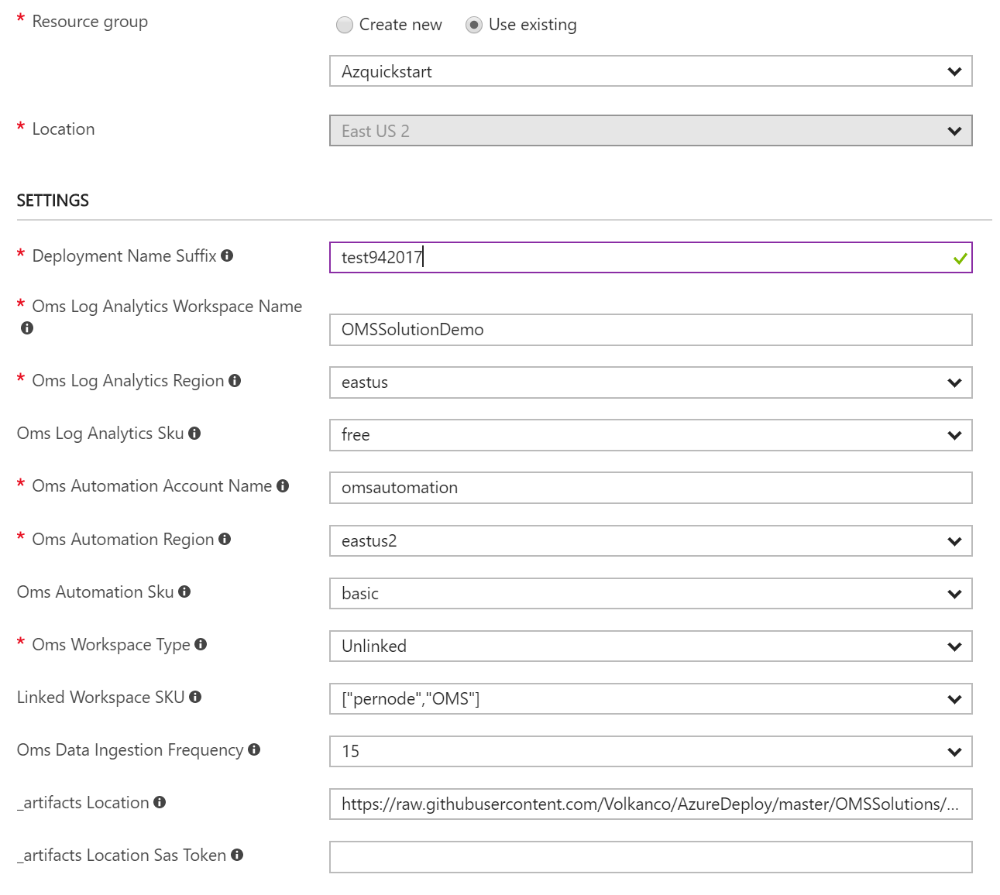
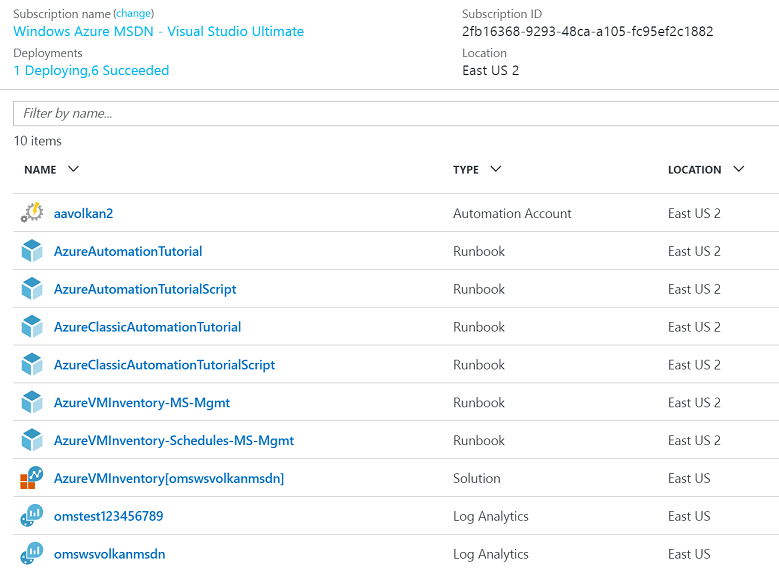
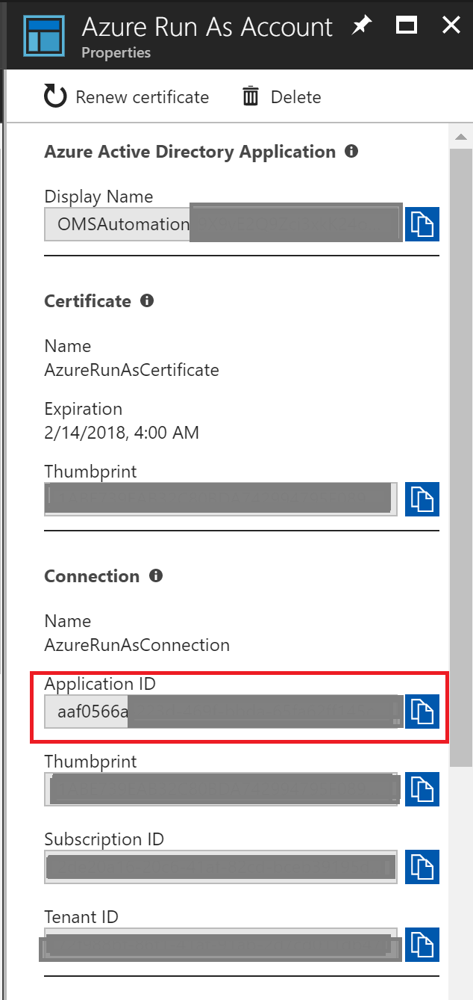

# Azure Virtual Machine Inventory

 

>[AZURE.NOTE]This is preliminary documentation for Azure VM Inventory , a management solution you can deploy into OMS that will provide insights of virtual machines and virtual machine scale sets across subscriptions. 

Azure VM Inventory  Solution collects and visualizes inventory information of a virtual machine along with ;
* Data and OS disks
* input endpoints for Classic VMs
* NSG Rules for ARM VMs
* VM Extensions
* Virtual Network,Subnet, internal and public IP 
* Virtual Machine Scale Sets information. 

Solution also collects overall core usage and other subscription level limits . This solution leverages Azure Automation, the Log Analytics Ingestion API, together with Log Analytics views to present data about all your virtual machines from different subscriptions  in a single  workspace. 

## Pre-reqs

- **Automation Account with SPN**

Before you deploy this template, you must create an Automation Account in the Azure portal with the default settings so that the SPN account will be created. If you have an existing OMS Log Analytics Workspace you would like to use for this solution, it is important that the Automation account is created into the **same Resource Group where the OMS Log Analytics Workspace is located**.

If you **dont** have an existing OMS Log Analytics Workspace, the template will create and deploy this for you.

## Deploying the Azure VM Inventory Solution

### Follow these instructions to deploy the solution into an existing - or new Log Analytics Workspace

Log into Azure Portal (https://portal.azure.com) and ensure you are in the subscription containing the recovery vault you want to monitor

Locate your existing OMS Log Analytics Workspace and note the name of the workspace, the location of the workspace, and the Resource Group

 

Next, create a new Automation Account and click on *New* and search for 'Automation'

 
Select Automation and click *Create* 

Specify the name of the Automation Account and ensure you are selecting 'Use existing' and selects the Resource Group containing the OMS Log Analytics workspace. If possible, use the same Azure Region for the Automation Account. Ensure that 'Create Azure Run As account' is set to 'Yes' and click 'Create'

Once the deployment has completed, you should see the Automation account and the Log Analytics workspace in the same Resource Group

###You can now deploy the template   
 

This will send you to the Azure Portal with some default values for the template parameters. 
Ensure that the parameters reflects your setup so that you are deploying this into the *existing* Resource Group containing the Log Analytics Workspace and the Automation account.

#### Please take caution on  OMS workspace SKU and Automation Account SKU as selections might effect the existing deployment.
#### Solution requires a new guid to be created every time  ARM template deployed. Using same guid will cause deployment to fail!

#### Parameters

* Deployment Name Suffix 

Specify any conbinamtion of characters or numbers . This random text is used to calculate guid for automation schedules.

* OMS Log Analytics Workspace Name

Specify the name of the workspace you want to deploy this solution to

* OMS Log Analytics Region

Select the Azure Region where your existing workspace is located

* OMS Log Analytics SKU

Select the Log Analytics SKU . IF you select linked workspace LinkedWorkspace SKU is used and this parameter is ignored.

* OMS Automation Account Name

Specify the name of the automation account you created earlier

* OMS Automation Region

Select the Azure Region where your automation account is located

* OMS Automation SKU

Select the Automation Account  SKU . IF you select linked workspace LinkedWorkspace SKU is used and this parameter is ignored.

* OMS Workspace Type

Select if the workspace   is linked to automation account 

* Linked Workspace SKU 

Select the SKU for Linked Workspace and Automation Account.

* OMS Data Ingestion Frequency 

Specify  how often to query for VM data , Choose 15 - 30 or 60 minutes.

Once you have customized all the parameters, click *Create*

The ingestion will start 5-10 minutes post deployment.

## Exploring the views

Once the template has successfully been deployed, Azure VM  inventory data ingestion should occur within 15 minutes post deployment.  If you are deploying the solution to a new workspace, it can take approximately 30 minutes before the indexing has completed for the workspace in general. 

In the Resource Group where you deployed the template, you should see the solution resource.

* AzureVMInventory[workspaceName]

### Azure VM Inventory

The views for Azure VM Inventory   will give you an overview of all the VMs  within your Azure Subscription.  Multiple subscriptions can be added to provide overview for all.

Scale Sets View 

Solution collects and visualizes ;

**VM Inventory Data**
Subnet
DeploymentName
DeplymentType
VM Name
FQDN
Location 
HW Profile (Size)
Status
VirtualNetwork
Subnet
Subscription
Resource Group

**NIC Details**
VirtualNetwork
IPAllocation (Static/Dynamic)
Subnet
NIC
Private IP
MAC Address
IpForwarding

**Input Endpointss** 
Name
enableDirectServerReturn
Public Port
Private Port
Protocol

**NSG Rules** 
RuleName
DestinationPortRange
Source Prefix
Destination Prefix
Protocal
Direction
Access (Allow/Deny)
NIC

**Extensions**

Name
VErsion
Publisher

**Disk**
StorageAccount
VHDUri
IO Type
DiskType (unmanaged/Managed)
Size
MaxIO

### Alerts

Solution has 2 alerts defined ;
VMs in Stopped State  and Azure Subscription Quota Reaching %90  . Additional alerts can be created by using  the inventory collected by the solution.

### Troubleshooting 

Solution relies on Automation Account with Runas Accounts  configured.  

General Troubleshooting steps ;
* If deployment fails , navigate to Resource Group and Delete the AzureVMInventory[workspaceName] solution. This will delete the solution and all associated automation artifacts.  After deletion you can redeploy the solution. When redeploying please make sure you use a unique string for deploymentnamesuffix parameter  as this parameter is used to calculate guids in automation schedules.

* Check if automation account can start  the runbooks. You may need to switch your automation sku to basic if you run out of free minutes in free sku.
* Check if Runas Accounts configured properly and has permission to read Azure Compute, Storage and Networking providers. 
* Check if there is any schedule associated with AzureVMInventory-MS-Mgmt-v2 runbook , if there is no schedule re-run AzureVMInventory-Schedules-MS-Mgmt-v2 runbook and all required schedules will be created.

## Adding Additional Subscriptions

You can enable data collection from multiple subscriptions by assigning read permission to  resources under Microsoft.Compute Microsoft.Storage and Microsoft.Networking to Automation SPN account. To get the SPN details from the portal. 

* Navigate the Automation Account used in VMInventory solution
* Select RunAs Accounts 
* Select Azure Run As Account
* Copy ApplicationID 

You will use this ApplicationID to provide access to additional subscriptions . 
Logon to the subscription you want to delegate access navigate to Subscriptions Blade and use Access Control to provide Reader  Role to youe Automation SPN. 
Solution will enumerate all subscription where it has access rights and  collect data from them. 

