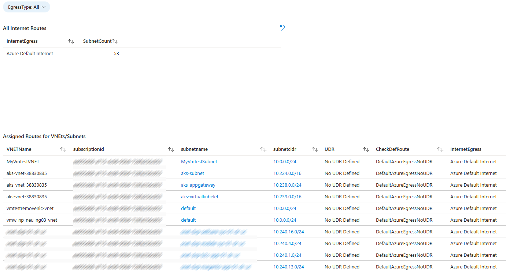

# Azure VM Size Optimization Wokbook

 

>[AZURE.NOTE]This is preliminary documentation for Azure Virtual Netwotk Insights  Workbook which helps vizualizing the  Virtual Networks, UDRS, NSGs and related settings. 

Azure Virtual Network Insights  Workbook  pulls information about 

* Azure Virtual Netwotks and their DDOS protection setting
* Subnets
* User Defines Routes
* Network Secuirty Groups 
* Internet Egress Configuration for each subnet

Using these views you can identfy the egress path of each subnet. You can check which subnets are sending internet to speicific firewall appliances and which ones has direc internet egress without firewall. 

## Pre-reqs

You need at least reader permission on the subscriptions where virtual networks are deployed. 

## Solution Views 

### DDOS 

DDOS tab displays DDOS protection coverage accross virtual networks. 

### NSG

NSG tab displays all network secuirty rules  across all subnets. You can filter the view by source/destination/directian and action to identify the applicable rules for the given virtaul netwirks. 

### Internet Eggress

Egress tab visuzlizes the internet egress configuration across virtual networks & subnets. By using this view you can identify which subnets has direct internet access and which ones are forced to any firewall appliance.

## Template Deployment

 

Once deployed workbook can be accessed under Azure Portal/Monitoring/Workbooks

