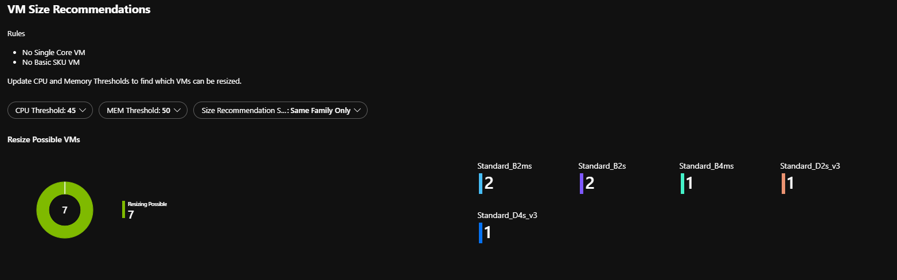
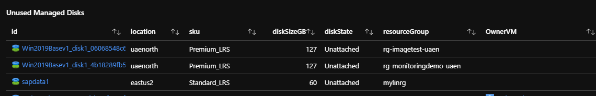

# Azure VM Size Optimization Wokbook

 

>[AZURE.NOTE]This is preliminary documentation for Azure VM Optimization Workbook which helps vizualizing the  VM usage indicators fetched from Azure Monitor/Log Analytics.

Azure Size Optimizations Workbook  corrlates  the following data per Azure VM ;

* RDP or SSH logins
* Reboots
* CPU Utilization 
* Memory Utilization
* Disk IOPs
* NW Sent / Receive
* Inbound Connections

Using these metrics  you can detect the VMs  that are idle ,  not in use anymore .  
Performance counters will be used to  check if optimal size is selected for the VM and gives you recommendations for smaller sizes. 
CPU metric is measured  based on peak hours setting  to analyze the real CPU  demand.

You can filter subscriptions , log analytics workspaces, resurce groups and set Peak hour Start End times. 

## Pre-reqs

- **Azure Monitor should be enabled for VMs**

Data is pulled from log analtics workspace and  all azure VMs  needs to be configured to report to one or many workspaces. 
VM Insights solution should be enabled to be able to provide Azure size history and size optimization recommendations.

## Solution Views 

